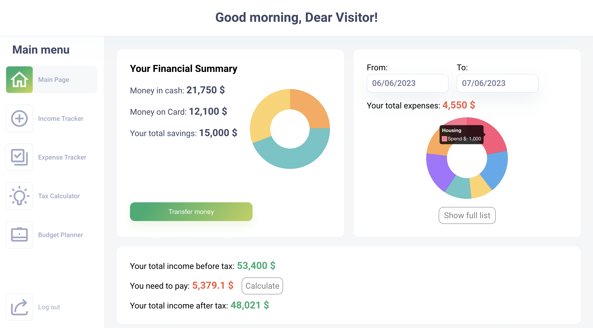

# **Financial Management Application**

A sophisticated and user-friendly web application designed to simplify personal finance management. Built using **React.js**, **Redux**, **CSS**, and **Firebase**, this app is a testament to my expertise in front-end and back-end development.

This project is part of my portfolio and is intended to showcase my ability to design and develop full-stack applications.

---

### Dashboard

  
_A clean interface summarizing key financial metrics._

---

## **About The Project**

Managing personal finances can often feel overwhelming. Whether it's tracking expenses, managing income, or planning for taxes, these tasks demand precision and time. This **Financial Management Application** was created as a comprehensive solution to these challenges.

Initially inspired by a personal challenge of accurately tracking income and saving for taxes, the app evolved into a robust tool featuring:

- **Expense Tracking** to monitor and categorize spending.
- **Income Tracking** to log and analyze earnings.
- **Tax Calculations** to simplify financial planning.
- **Budget Planning** based on the 50/30/20 rule for effective financial management.

This project not only highlights my technical skills but also demonstrates my ability to design solutions for real-world problems.

---

## **Key Features**

### Expense Tracker

- Record expenses and categorize them into predefined categories like housing, groceries, and entertainment.
- Visualize spending patterns over time with interactive **charts and graphs**.
- Set spending limits to avoid overspending.

### Income Tracker

- Log multiple sources of income with details such as date, amount, and tax applicability.
- View income trends and total earnings across specific timeframes.

### Tax Calculator

- Calculate tax liability based on current tax regulations.
- Input income, deductions, and filing status to get an instant tax estimate.
- Simplify decision-making with clear tax breakdowns.

### Budget Planner

- Plan your finances using the **50/30/20 rule**, dividing income into needs, wants, and savings.
- Adjust and monitor budget goals dynamically.
- Compare planned vs. actual spending to track financial health.

### Secure Authentication

- Built with **Firebase Authentication** to ensure data privacy and security.
- Users can create accounts, log in securely, and access their personalized financial data.

---

## **Technologies Used**

- **React.js**: Enables a dynamic and seamless user experience.
- **Redux**: Ensures efficient and predictable state management.
- **CSS**: Provides responsive and aesthetically pleasing designs.
- **Firebase**: Handles authentication and database management with ease.

---

## **Setup Instructions**

### Prerequisites

Before running the application, ensure the following are installed:

- **Node.js** (v16 or higher)
- **npm** (Node Package Manager)
- **Git**

### Installation

1. Clone the Repository:

   ```bash
   git clone https://github.com/iamqitmeer/finance-management.git
   cd finance-management
   ```

2. Install Dependencies:

   ```bash
   npm install
   ```

3. Start the Application:

   ```bash
   npm start
   ```

4. Open the application in your browser at `http://localhost:3000`.

---

## **Usage Guide**

1. **Sign Up**: Create an account to securely store and access your financial data.
2. **Add Expenses**: Log daily expenses and assign them to specific categories.
3. **Track Income**: Record your earnings and analyze trends.
4. **Calculate Taxes**: Use the tax calculator to estimate your tax obligations.
5. **Plan Budgets**: Create and monitor personalized budgets to stay on track.

## **Planned Improvements**

- Add **multi-currency support** to cater to global users.
- Include a **savings tracker** for more comprehensive financial insights.
- Implement AI-driven insights for smarter financial decision-making.
- Introduce **export options** for generating reports in PDF/Excel formats.

---

## **Frequently Asked Questions**

### Is this project open-source?

No, this project is part of my portfolio and is not available for public contribution or modification.

### Can I use this application for managing my finances?

While the app is functional, it is intended solely as a demonstration of my skills and not for public or commercial use.

---

## **Contact Information**

Developed by **Qitmeer Raza**

- **GitHub**: [GitHub](https://github.com/iamqitmeer)
- **Portfolio**: [Portfolio](https://iamqitmeer-portfolio.vercel.app)
- **LinkedIn**: [LinkedIn](https://linkedin.com/in/iamqitmeer)
- **GitHub**: [Twitter (X)](https://x.com/iamqitmeer)

Feel free to explore my other projects and share your feedback!
=======